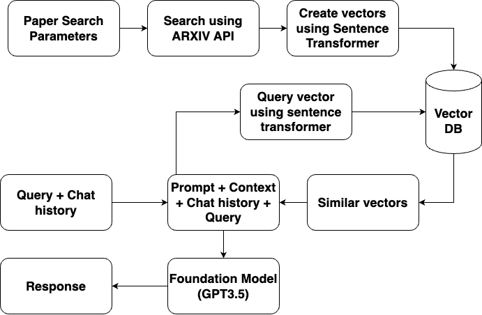

# Talk-to-papers-RAG
## Retrieval Augmented Generation for LLMs to Interact with ArXiv Papers

## Introduction

This project develops a Retrieval-Augmented Generation (RAG) system that enhances language model interactions with academic papers from the arXiv database. By leveraging the power of the arXiv API and advanced vectorization techniques, the system provides a rich, contextual conversational experience, allowing for in-depth discussion and analysis of scientific papers.

## System Workflow

### Overview of the RAG Flow

The diagram below illustrates the RAG system flow:

### Workflow Steps

1. **Input Search Parameters**: Users set parameters to search academic papers.
2. **Fetch from ARXIV API**: The system queries the arXiv API using these parameters.
3. **Vectorization of Papers**: Academic papers are transformed into semantic vectors with a Sentence Transformer and stored in a Vector DB.
4. **User Query Vectorization**: User queries are similarly vectorized for semantic comparison.
5. **Retrieval from Vector DB**: The system matches the query vector with the Vector DB to retrieve similar paper vectors.
6. **Foundation Model Interaction**: A Foundation Model (e.g., GPT-3.5) uses the retrieved vectors along with the chat history to create contextually relevant prompts.
7. **Response Generation**: The Foundation Model generates responses that integrate information from the matched papers, enriching the conversation with data-driven insights.

## Key Components

- **ARXIV API Interface**: Manages paper search and retrieval.
- **Vectorization Module**: Transforms text data into semantic vectors.
- **Vector DB**: Stores and retrieves vectors for similarity matching.
- **Sentence Transformer**: Converts text to vectors for semantic searches.
- **Chat Management System**: Maintains conversation history for context.
- **Foundation Model (GPT-3.5)**: Generates responses based on vector matches and conversational context.

